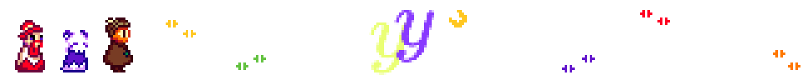

# ✨ yy-luna compiler



Named in part as a reference to yy-chr, yy-luna is an experimental compiler project, made just for fun, but also to be embeddable into anything.

### I will like to compile someday this for a NES straight:

```ts
import "ines.yy"

@section "HEADER" {
    var : INES.Header;
}

@section "CHARS" {
    var : uint8[] = @dump_byte_array("rojo.chr");
}

@section "ZEROPAGE" {
    var frame_counter: u8;
}

@section "STARTUP" {
    @func.no_frame
    function main(): void {
        INES.reset();

        while (true) {
            /* Main loop */
            frame_counter++;
        }
    }

    @func.no_frame
    isr v_blank(): void {
        /* V-Blank interrupt service routine
        This isr is called during the V-Blank period */
    }
}

@section "VECTORS" {
    var : INES.Address[] = [
        &v_blank,
        &main
    ];
}
```

## Installing

I want to keep this thing as simple and dependency-free as I can, such that linking it after forgetting about it for a while is not a nightmare.

Portable binaries will be available under the releases section.

### Compiling from source

```bash
git clone https://github.com/Alex461538/yy-luna
cd yy-luna
cmake -S . -B build
cmake --build build
```

With your specific environment or toolchain, you should grab any required libraries easily for linking. For windows I like vcpkg, and for linux I really like  raw apt, it works somehow.


## License

This project is under the [Artistic License 2.0](https://opensource.org/license/artistic-2-0). I want to be flexible and also this machine has some value for me, in short words this license states:

- Free modification and redistribution provided that:
- Any modification is explicitly marked as such.

It also requires that every modified package references the original in a detailed form, I don't care, just mark it as a mod and that's it 🥀.