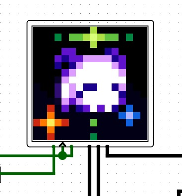
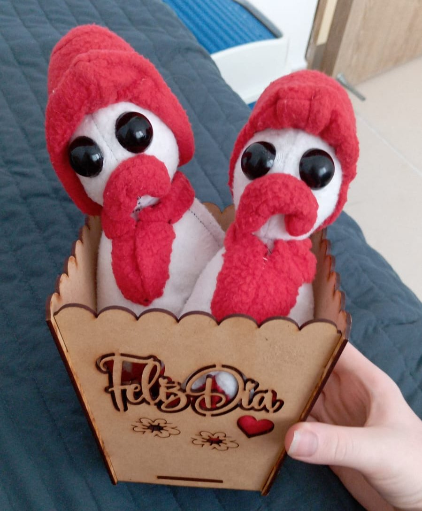
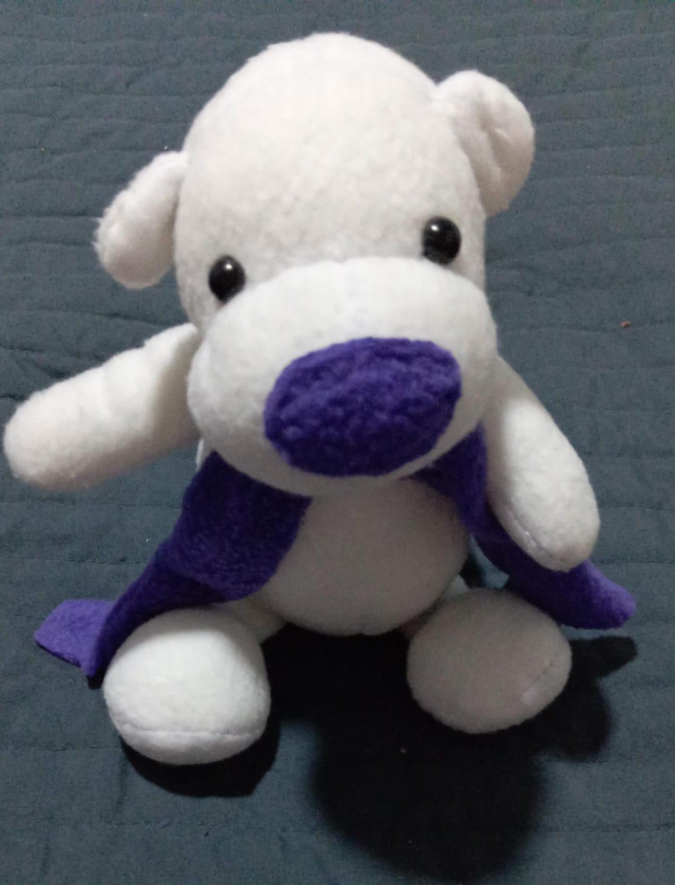

# ✨ yy-luna compiler


Named in part as a reference to yy-chr, yy-luna is an experimental compiler project, made just for fun, but also to be embeddable into anything.

### I will like to compile someday this for a NES straight:

```ts
import "ines.yy"

@section "HEADER" {
    var : INES.Header;
}

@section "CHARS" {
    var : uint8[] = @dump_byte_array("rojo.chr");
}

@section "ZEROPAGE" {
    var frame_counter: u8;
}

@section "STARTUP" {
    @func.no_frame
    function main(): void {
        INES.reset();

        while (true) {
            /* Main loop */
            frame_counter++;
        }
    }

    @func.no_frame
    isr v_blank(): void {
        /* V-Blank interrupt service routine
        This isr is called during the V-Blank period */
    }
}

@section "VECTORS" {
    var : INES.Address[] = [
        &v_blank,
        &main
    ];
}
```

## Roadmap

### ☔️ Completed

- [x] Basic CLI frontend (build and rpc-connect commands)
- [x] Workspace/Package/File loader classes
- [x] Lexer implementation
- [x] Basic preprocessor (imports)
- [x] RPC-LSP stdio connection

### 🔑 In Progress

- [ ] RPC/LSP integration and refactoring
- [ ] Import system refinement

### ⁉️ Planned

#### Frontend

- [ ] Complete LSP server implementation
- [ ] Enhanced preprocessor features

#### Middle-end

- [ ] AST construction
- [ ] Semantic analysis
- [ ] Type checking
- [ ] Symbol resolution

#### Backend

- [ ] Documentation generator (LaTeX/PDF)
- [ ] Code generation
- [ ] LLVM IR backend
- [ ] Custom backend for embedded targets (NES, etc.)

#### Tooling & Libraries

- [ ] Standard library
- [ ] Example projects

## Installing

I want to keep this thing as simple and dependency-free as I can, such that linking it after forgetting about it for a while is not a nightmare.

Portable binaries will be available under the releases section.

### Compiling from source

```bash
git clone https://github.com/Alex461538/yy-luna
cd yy-luna
cmake -S . -B build
cmake --build build
```

With your specific environment or toolchain, you should grab any required libraries easily for linking. For windows I like vcpkg, and for linux I really like  raw apt, it works somehow.

## Environment setup

This machine is designed to be portable, so it does not need any extra setup to run.

But if you want to execute this easily or integrate it in your IDE, add the executable folder to the path, and point to it with `YY_LUNA_HOME`.

## Running

### Response checking

If you just installed this thing and want to test it, run this command to see a nice banner!

```bash
yy-luna version
```

### Project building

What should I say?

```bash
yy-luna build --source ./my-project --pkg exe --isa x86-64 --osapi windows
```

I have also the idea of adding docs:

```bash
yy-luna build --source ./my-project --pkg latex-pdf
```

### json RPC / LSP support

Currently only `stdio` communication is supported, see the [LSP spec](https://microsoft.github.io/language-server-protocol/) and integrate YY in your IDE!

```bash
yy-luna rpc-connect --transport stdio
```

## License

This project has some value for me, but also I want to be flexible, so I picked [Artistic License 2.0](https://opensource.org/license/artistic-2-0). In short words this license states:

- Free modification and redistribution provided that:
- Any modification is explicitly marked as such.
- You reference the original project.

## ⚕️ Art

 | 
:---:|:---:
 | 
 |  